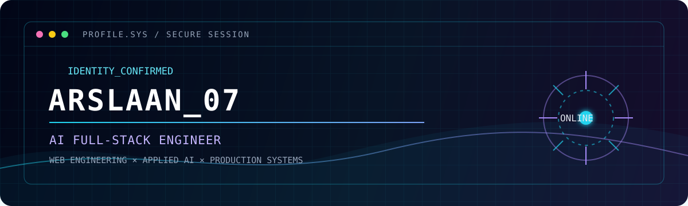

<p align="center">
  
</p>

<p align="center">
  <a href="https://github.com/arslaan07">
    
  </a>
</p>

```text
> BOOT_SEQUENCE: COMPLETE
> STATUS: Designing intelligent products, from interface to inference.
```

## ◈ System profile

I'm **Arslaan**, an **AI Full-Stack Engineer** building production-grade systems where thoughtful web engineering meets applied AI. I work across modern TypeScript platforms, dependable backend services, and LLM-powered experiences that solve real user problems.

```ts
const engineeringFocus = {
  ship: ["fast, thoughtful product experiences", "reliable APIs and data layers"],
  explore: ["practical RAG", "LLM applications", "AI features worth putting in production"],
};
```

## ◈ Installed modules

| Module | System capabilities |
| :-- | :-- |
| `WEB_PLATFORM` | TypeScript · Next.js · React |
| `BACKEND_AND_DATA` | NestJS · PostgreSQL |
| `APPLIED_AI` | Python · LangChain · RAG · LLM applications |

## ◈ Operating principles

```text
01. Start with the user problem, then earn the complexity.
02. Build systems that are useful in production, not just impressive in demos.
03. Treat AI as a product capability — grounded, observable, and intentional.
```

## ◈ GitHub telemetry

<p align="center">
  
  
</p>

<p align="center">
  
</p>

## ◈ Open channel

<p align="center">
  <a href="https://github.com/arslaan07"></a>
</p>

<p align="center"><sub>Connection established. Build something useful.</sub></p>

<!-- sudo collaborate --with arslaan07 -->
